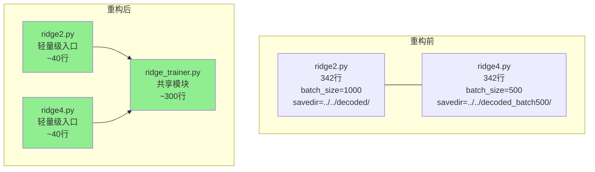

# 1. 问题

`ridge2.py` 和 `ridge4.py` 两个文件存在超过 90% 的代码重复，仅在默认批次大小和保存目录上有微小差异，违反了 DRY（Don't Repeat Yourself）原则。

## 1.1. **代码高度重复**

两个文件包含几乎完全相同的函数实现：
- `set_random_seeds`：设置随机种子（第 29-34 行）
- `check_batch_completed`：检查批次是否完成（第 36-39 行）
- `get_completed_batches`：获取已完成批次列表（第 41-46 行）
- `load_batch_model`：加载批次模型（第 48-55 行）
- `create_memory_mapped_array`：创建内存映射数组（第 57-75 行）
- `train_ridge_batch`：训练单个批次（第 77-106 行）
- `main` 函数的核心逻辑（第 108-342 行）

唯一差异在于：
- `ridge2.py`：默认 `batch_size=1000`，保存目录为 `../../decoded/{subject}/`
- `ridge4.py`：默认 `batch_size=500`，保存目录为 `../../decoded_batch500/{subject}/`

## 1.2. **维护成本高昂**

当需要修改公共逻辑时，必须在两个文件中同步修改。例如：
- 如果要优化内存映射逻辑，需要同时修改两个文件
- 如果要调整批处理训练流程，需要确保两个文件保持一致
- 如果要添加新的功能（如新的评估指标），需要复制到两个文件

这种重复增加了维护成本，容易导致遗漏和不一致。

## 1.3. **降低可测试性和可读性**

重复代码使得：
- 测试用例需要在两个文件上重复编写
- 代码审查时需要同时检查两个文件的逻辑一致性
- 新团队成员难以理解为什么存在两个几乎相同的文件
- 代码库体积膨胀，影响整体可读性

# 2. 收益

通过提取公共逻辑到共享模块，可以显著提升代码质量和维护效率。

## 2.1. **消除重复，降低维护成本**

将公共逻辑提取到共享模块后，任何修改只需在一处进行，自动应用到所有使用该模块的脚本。预计可以减少约 90% 的重复代码，从 684 行（两个文件）减少到约 380 行（一个共享模块 + 两个轻量级入口脚本）。

## 2.2. **提升代码可测试性**

共享模块可以独立进行单元测试，测试用例只需编写一次即可覆盖所有使用该模块的脚本。这将显著提高测试覆盖率，降低回归测试的成本。

## 2.3. **增强代码可读性和可扩展性**

重构后的代码结构更加清晰：
- 共享模块专注于核心逻辑，职责单一
- 入口脚本仅负责参数解析和调用，简洁明了
- 未来添加新的批次大小配置时，只需创建新的轻量级入口脚本

# 3. 方案

通过提取公共逻辑到共享模块 `ridge_trainer.py`，并保留两个轻量级入口脚本，实现代码复用和配置隔离。

## 3.1. **创建共享训练模块**

创建新文件 `ridge_trainer.py`，包含所有公共函数和核心训练逻辑：

```python
# ridge_trainer.py
import os
import gc
import numpy as np
import joblib
from himalaya.backend import set_backend
from himalaya.ridge import RidgeCV
from himalaya.scoring import correlation_score
from sklearn.pipeline import make_pipeline
from sklearn.preprocessing import StandardScaler
import random


def set_random_seeds(seed):
    """设置所有随机种子以确保可复现性"""
    random.seed(seed)
    np.random.seed(seed)
    os.environ['PYTHONHASHSEED'] = str(seed)


def check_batch_completed(savedir, subject, roi, target, batch_idx):
    """检查指定批次是否已完成训练"""
    model_path = f'{savedir}/{subject}_{"_".join(roi)}_pipeline_{target}_batch_{batch_idx}.joblib'
    return os.path.exists(model_path)


def get_completed_batches(savedir, subject, roi, target, n_batches):
    """获取已完成的批次列表"""
    completed = []
    for batch_idx in range(n_batches):
        if check_batch_completed(savedir, subject, roi, target, batch_idx):
            completed.append(batch_idx)
    return completed


def load_batch_model(savedir, subject, roi, target, batch_idx):
    """加载已保存的批次模型"""
    model_path = f'{savedir}/{subject}_{"_".join(roi)}_pipeline_{target}_batch_{batch_idx}.joblib'
    try:
        return joblib.load(model_path)
    except Exception as e:
        print(f"加载批次 {batch_idx} 模型失败: {e}")
        return None


def create_memory_mapped_array(data, temp_dir, filename):
    """创建内存映射数组以减少内存使用"""
    if not os.path.exists(temp_dir):
        os.makedirs(temp_dir)
    
    filepath = os.path.join(temp_dir, filename)
    if os.path.exists(filepath):
        os.remove(filepath)
    
    mmap_array = np.memmap(filepath, dtype='float32', mode='w+', shape=data.shape)
    mmap_array[:] = data.astype('float32')
    mmap_array.flush()
    del mmap_array
    gc.collect()
    
    return np.memmap(filepath, dtype='float32', mode='r', shape=data.shape)


def train_ridge_batch(X, Y_batch, alpha_values, batch_idx):
    """训练单个批次的脊回归模型"""
    try:
        ridge = RidgeCV(alphas=alpha_values)
        preprocess_pipeline = make_pipeline(StandardScaler(with_mean=True, with_std=True))
        pipeline = make_pipeline(preprocess_pipeline, ridge)
        pipeline.fit(X, Y_batch)
        gc.collect()
        return pipeline, True
    except Exception as e:
        print(f"批次 {batch_idx} 训练失败: {str(e)}")
        gc.collect()
        return None, False


def load_data(mridir, featdir, subject, roi, target):
    """加载 fMRI 数据和目标特征"""
    print("Loading fMRI data...")
    X = []
    X_te = []
    
    for croi in roi:
        if 'conv' in target:
            cX = np.load(f'{mridir}/{subject}_{croi}_betas_ave_tr.npy').astype("float32")
        else:
            cX = np.load(f'{mridir}/{subject}_{croi}_betas_tr.npy').astype("float32")
        cX_te = np.load(f'{mridir}/{subject}_{croi}_betas_ave_te.npy').astype("float32")
        X.append(cX)
        X_te.append(cX_te)
    
    X = np.hstack(X).astype('float32')
    X_te = np.hstack(X_te).astype('float32')
    
    print("Loading target features...")
    Y = np.load(f'{featdir}/{subject}_each_{target}_tr.npy').astype("float32").reshape([X.shape[0], -1])
    Y_te = np.load(f'{featdir}/{subject}_ave_{target}_te.npy').astype("float32").reshape([X_te.shape[0], -1])
    
    return X, X_te, Y, Y_te


def train_and_predict(subject, roi, target, batch_size, savedir, temp_dir, 
                      use_memmap, seed, resume, alpha):
    """
    执行完整的训练和预测流程
    
    参数:
        subject: 被试名称
        roi: ROI 列表
        target: 目标变量
        batch_size: 批次大小
        savedir: 保存目录
        temp_dir: 临时文件目录
        use_memmap: 是否使用内存映射
        seed: 随机种子
        resume: 是否断点续训
        alpha: 正则化参数列表
    """
    set_random_seeds(seed)
    print(f"设置随机种子: {seed}")
    
    backend = set_backend("numpy", on_error="warn")
    
    mridir = f'../../mrifeat/{subject}/'
    featdir = '../../nsdfeat/subjfeat/'
    os.makedirs(savedir, exist_ok=True)
    os.makedirs(temp_dir, exist_ok=True)
    
    X, X_te, Y, Y_te = load_data(mridir, featdir, subject, roi, target)
    
    print(f'Processing data for... {subject}: {roi}, {target}')
    print(f'X {X.shape}, Y {Y.shape}, X_te {X_te.shape}, Y_te {Y_te.shape}')
    print(f'Estimated memory usage: {(Y.nbytes / 1024**3):.2f} GB')
    
    if use_memmap:
        print("Creating memory-mapped arrays...")
        X = create_memory_mapped_array(X, temp_dir, 'X_train.dat')
        Y = create_memory_mapped_array(Y, temp_dir, 'Y_train.dat')
        X_te = create_memory_mapped_array(X_te, temp_dir, 'X_test.dat')
        Y_te = create_memory_mapped_array(Y_te, temp_dir, 'Y_test.dat')
    
    n_features = Y.shape[1]
    n_batches = (n_features + batch_size - 1) // batch_size
    print(f"将分 {n_batches} 个批次处理，每批次最多 {batch_size} 个特征")
    
    completed_batches = []
    if resume:
        completed_batches = get_completed_batches(savedir, subject, roi, target, n_batches)
        if completed_batches:
            print(f"发现已完成的批次: {completed_batches}")
            print(f"将跳过这些批次，继续训练剩余的 {n_batches - len(completed_batches)} 个批次")
        else:
            print("未发现已完成的批次，从头开始训练")
    
    models = []
    batch_info = []
    
    for batch_idx in range(n_batches):
        start_idx = batch_idx * batch_size
        end_idx = min((batch_idx + 1) * batch_size, n_features)
        
        if resume and batch_idx in completed_batches:
            print(f"跳过已完成的批次 {batch_idx + 1}/{n_batches}")
            model = load_batch_model(savedir, subject, roi, target, batch_idx)
            if model is not None:
                models.append(model)
                batch_info.append((start_idx, end_idx))
            continue
        
        print(f"\n处理批次 {batch_idx + 1}/{n_batches}: 特征 {start_idx} 到 {end_idx-1}")
        
        try:
            Y_batch = Y[:, start_idx:end_idx].copy()
            model, success = train_ridge_batch(X, Y_batch, alpha, batch_idx)
            
            if success:
                models.append(model)
                batch_info.append((start_idx, end_idx))
                model_path = f'{savedir}/{subject}_{"_".join(roi)}_pipeline_{target}_batch_{batch_idx}.joblib'
                joblib.dump(model, model_path)
                print(f'批次 {batch_idx} 模型已保存到: {model_path}')
            else:
                print(f'批次 {batch_idx} 训练失败，跳过')
            
            del Y_batch
            if not success:
                del model
            gc.collect()
        except Exception as e:
            print(f"批次 {batch_idx} 处理出错: {e}")
            gc.collect()
            continue
    
    print(f"\n成功训练了 {len(models)} 个批次模型")
    
    print("开始预测...")
    all_predictions = []
    batch_accuracies = []
    
    for batch_idx, (model, (start_idx, end_idx)) in enumerate(zip(models, batch_info)):
        print(f"预测批次 {batch_idx + 1}/{len(models)}")
        
        try:
            Y_te_batch = Y_te[:, start_idx:end_idx]
            predictions = model.predict(X_te)
            all_predictions.append(predictions)
            
            if Y_te_batch.shape[1] > 0:
                rs_batch = correlation_score(Y_te_batch.T, predictions.T)
                batch_accuracy = np.mean(rs_batch)
                batch_accuracies.append(batch_accuracy)
                print(f'批次 {batch_idx} 预测准确率: {batch_accuracy:.3f}')
            
            del predictions, Y_te_batch, rs_batch
            gc.collect()
        except Exception as e:
            print(f"批次 {batch_idx} 预测出错: {e}")
            gc.collect()
            continue
    
    if all_predictions:
        scores = np.hstack(all_predictions)
        rs = correlation_score(Y_te.T, scores.T)
        overall_accuracy = np.mean(rs)
        print(f'总体预测准确率: {overall_accuracy:.3f}')
        
        np.save(f'{savedir}/{subject}_{"_".join(roi)}_scores_{target}.npy', scores)
        
        model_info = {
            'subject': subject,
            'roi': roi,
            'target': target,
            'X_shape': X.shape,
            'Y_shape': Y.shape,
            'n_batches': len(models),
            'batch_size': batch_size,
            'prediction_accuracy': overall_accuracy,
            'batch_info': batch_info,
            'batch_accuracies': batch_accuracies,
            'seed': seed,
            'completed_time': str(gc.get_count())
        }
        joblib.dump(model_info, f'{savedir}/{subject}_{"_".join(roi)}_model_info_{target}.joblib')
        print(f'预测结果已保存到: {savedir}')
        
        del scores, rs, all_predictions
        gc.collect()
    else:
        print("没有成功的预测结果")
    
    del X, Y, X_te, Y_te, models
    gc.collect()
    
    if use_memmap:
        print("清理临时文件...")
        import shutil
        try:
            if os.path.exists(temp_dir):
                shutil.rmtree(temp_dir)
                print("临时文件清理完成")
        except Exception as e:
            print(f"清理临时文件时出错: {e}")
```

## 3.2. **重构 ridge2.py 为轻量级入口**

将 `ridge2.py` 重构为调用共享模块的轻量级入口：

```python
# ridge2.py
import argparse
from ridge_trainer import train_and_predict

'''
基本使用（默认批次大小1000）
python ridge2.py --target c --roi ventral --subject subj01

使用更小的批次大小（如果仍有内存问题）
python ridge2.py --target c --roi ventral --subject subj01 --batch_size 500

使用内存映射进一步优化内存
python ridge2.py --target c --roi ventral --subject subj01 --batch_size 1000 --use_memmap

设置随机种子确保可复现
python ridge2.py --target c --roi ventral --subject subj01 --seed 42

断点续训（自动跳过已完成的批次）
python ridge2.py --target c --roi ventral --subject subj01 --resume
'''

def main():
    parser = argparse.ArgumentParser()
    parser.add_argument("--target", type=str, default='', help="Target variable")
    parser.add_argument("--roi", required=True, type=str, nargs="*", help="use roi name")
    parser.add_argument("--subject", type=str, default=None, help="subject name")
    parser.add_argument("--batch_size", type=int, default=1000, help="批次大小，用于分批处理Y")
    parser.add_argument("--use_memmap", action='store_true', help="使用内存映射减少内存占用")
    parser.add_argument("--seed", type=int, default=42, help="随机种子，确保可复现性")
    parser.add_argument("--resume", action='store_true', help="断点续训，跳过已完成的批次")
    
    opt = parser.parse_args()
    
    if opt.target == 'c' or opt.target == 'init_latent':
        alpha = [0.000001, 0.00001, 0.0001, 0.001, 0.01, 0.1, 1]
    else:
        alpha = [10000, 20000, 40000]
    
    savedir = f'../../decoded/{opt.subject}/'
    temp_dir = f'../../temp/{opt.subject}/'
    
    train_and_predict(
        subject=opt.subject,
        roi=opt.roi,
        target=opt.target,
        batch_size=opt.batch_size,
        savedir=savedir,
        temp_dir=temp_dir,
        use_memmap=opt.use_memmap,
        seed=opt.seed,
        resume=opt.resume,
        alpha=alpha
    )

if __name__ == "__main__":
    main()
```

## 3.3. **重构 ridge4.py 为轻量级入口**

将 `ridge4.py` 重构为调用共享模块的轻量级入口：

```python
# ridge4.py
import argparse
from ridge_trainer import train_and_predict

'''
本脚本所有模型和预测结果均保存到 ../../decoded_batch500/{subject}/ 目录
用于 batch_size=500 的分批训练，不会覆盖默认 batch_size 结果

基本使用（默认批次大小500）
python ridge4.py --target c --roi ventral --subject subj01

使用更小的批次大小（如果仍有内存问题）
python ridge4.py --target c --roi ventral --subject subj01 --batch_size 500

使用内存映射进一步优化内存
python ridge4.py --target c --roi ventral --subject subj01 --batch_size 500 --use_memmap

设置随机种子确保可复现
python ridge4.py --target c --roi ventral --subject subj01 --seed 42

断点续训（自动跳过已完成的批次）
python ridge4.py --target c --roi ventral --subject subj01 --resume
'''

def main():
    parser = argparse.ArgumentParser()
    parser.add_argument("--target", type=str, default='', help="Target variable")
    parser.add_argument("--roi", required=True, type=str, nargs="*", help="use roi name")
    parser.add_argument("--subject", type=str, default=None, help="subject name")
    parser.add_argument("--batch_size", type=int, default=500, help="批次大小，用于分批处理Y")
    parser.add_argument("--use_memmap", action='store_true', help="使用内存映射减少内存占用")
    parser.add_argument("--seed", type=int, default=42, help="随机种子，确保可复现性")
    parser.add_argument("--resume", action='store_true', help="断点续训，跳过已完成的批次")
    
    opt = parser.parse_args()
    
    if opt.target == 'c' or opt.target == 'init_latent':
        alpha = [0.000001, 0.00001, 0.0001, 0.001, 0.01, 0.1, 1]
    else:
        alpha = [10000, 20000, 40000]
    
    savedir = f'../../decoded_batch500/{opt.subject}/'
    temp_dir = f'../../temp/{opt.subject}/'
    
    train_and_predict(
        subject=opt.subject,
        roi=opt.roi,
        target=opt.target,
        batch_size=opt.batch_size,
        savedir=savedir,
        temp_dir=temp_dir,
        use_memmap=opt.use_memmap,
        seed=opt.seed,
        resume=opt.resume,
        alpha=alpha
    )

if __name__ == "__main__":
    main()
```

## 3.4. **架构对比**

重构前后的架构对比：



上图展示了重构前后的代码结构变化。重构前，两个文件各自包含完整的训练逻辑，存在大量重复。重构后，公共逻辑被提取到 `ridge_trainer.py` 共享模块中，两个入口脚本仅负责参数解析和调用，代码量大幅减少。

# 4. 回归范围

本次重构主要涉及代码结构的调整，不改变训练和预测的核心逻辑，因此回归测试范围相对集中。

## 4.1. 主链路

需要验证以下主要场景：

1. **默认批次训练**
   - 使用 `ridge2.py` 执行默认批次大小（1000）的训练
   - 验证模型能够正常训练、保存和预测
   - 确认预测结果与重构前一致

2. **小批次训练**
   - 使用 `ridge4.py` 执行小批次大小（500）的训练
   - 验证模型能够正常训练、保存和预测
   - 确认预测结果与重构前一致

3. **自定义批次大小**
   - 使用 `--batch_size` 参数指定其他批次大小（如 200、800）
   - 验证训练流程正常完成

4. **内存映射优化**
   - 使用 `--use_memmap` 参数启用内存映射
   - 验证内存使用是否降低，训练是否正常完成

5. **断点续训**
   - 使用 `--resume` 参数执行断点续训
   - 验证已完成的批次能够正确跳过，训练能够从断点继续

## 4.2. 边界情况

需要验证以下边界和异常场景：

1. **极端批次大小**
   - 批次大小为 1（每个特征一个批次）
   - 批次大小大于特征总数（单批次处理所有特征）

2. **随机种子一致性**
   - 使用相同的随机种子多次运行，验证结果是否一致
   - 使用不同的随机种子，验证结果是否有差异

3. **文件系统异常**
   - 保存目录不存在时，验证是否自动创建
   - 临时文件清理是否正常执行

4. **训练失败场景**
   - 模拟批次训练失败，验证是否正确跳过并继续
   - 验证错误信息是否正确输出

5. **数据加载异常**
   - 验证数据文件不存在时的错误处理
   - 验证数据格式异常时的错误处理

# 5. 附录：准确度计算方式

在脑解码任务中，准确度通过 **Pearson 相关系数**（Correlation Coefficient）来衡量，这是 `himalaya.scoring.correlation_score` 函数提供的标准评估方法。

## 5.1. 计算逻辑

准确度计算位于训练后的预测阶段，代码如下：

```python
# 1. 每个批次的准确率
rs_batch = correlation_score(Y_te_batch.T, predictions.T)
batch_accuracy = np.mean(rs_batch)

# 2. 总体准确率
rs = correlation_score(Y_te.T, scores.T)
overall_accuracy = np.mean(rs)
```

## 5.2. 详细说明

| 步骤 | 代码 | 说明 |
|------|------|------|
| **输入** | `Y_te_batch.T`, `predictions.T` | 真实标签（测试集特征）和预测值，形状为 (n_features, n_samples) |
| **计算** | `correlation_score()` | 计算每个特征维度上的 Pearson 相关系数 |
| **平均** | `np.mean()` | 对所有特征维度的相关系数取均值 |

## 5.3. 什么是 correlation_score？

`himalaya` 库提供的 `correlation_score` 函数用于计算预测值和真实值之间的相关性：

- **输入**：两组 2D 数组，形状为 (n_features, n_samples)
- **输出**：形状为 (n_features,) 的相关系数数组，每个特征一个相关系数

## 5.4. 为什么使用相关系数而非准确率？

因为这是一个**回归问题**（从 fMRI 信号预测图像特征），不是分类问题：

- **回归任务** → 使用 Pearson 相关系数衡量预测精度
- **分类任务** → 使用准确率（正确分类的比例）

相关系数的取值范围是 [-1, 1]，越接近 1 表示预测效果越好。训练输出中看到的 `0.xxx` 就是平均相关系数。例如 `总体预测准确率: 0.356` 表示模型预测的特征与真实特征的总体相关性为 0.356。
